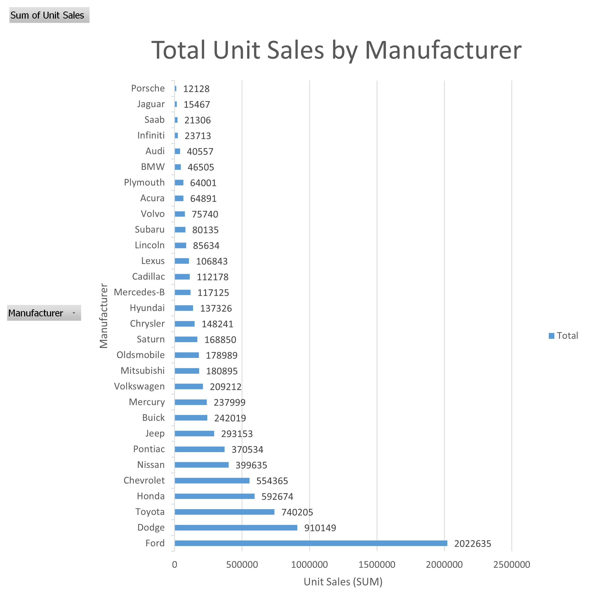
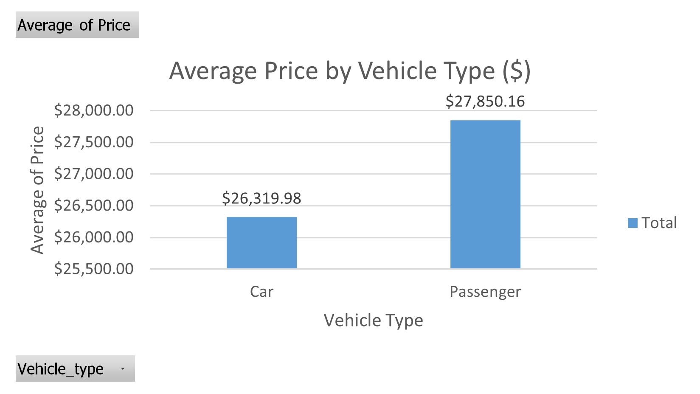
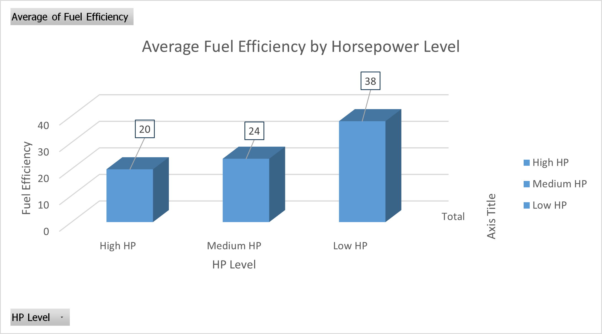
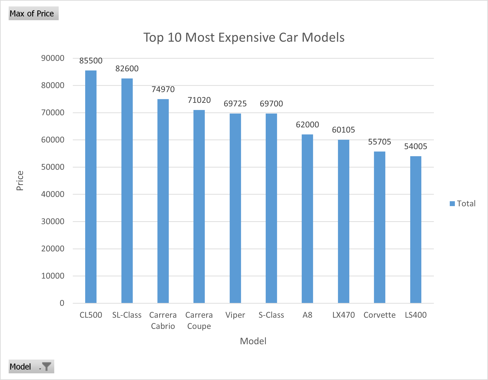
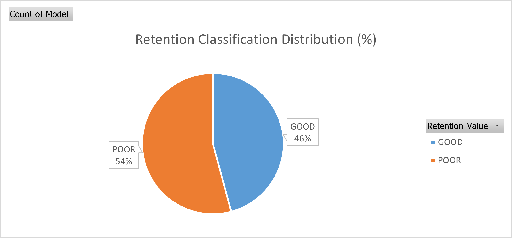

# 🚗 Car Sales Data Visualization Project

This repository contains my final data visualization project analyzing automotive sales, pricing, performance, fuel efficiency, and resale value using Microsoft Excel.

The objective of this project is to transform raw vehicle market data into meaningful business insights through data cleaning, aggregation, and visualization techniques.

---

# 📊 Project Overview

**Course:** Data Visualization
**Tool Used:** Microsoft Excel
**Project Type:** Final Visualization Project
**Dataset Domain:** Automotive Sales & Performance

The dataset contains information about multiple vehicle manufacturers and models, including sales performance, pricing, engine specifications, and resale retention.

**Number of Rows:** 155
**Number of Attributes Used:** ~12 (after cleaning)

---

# 🗂 Dataset Attributes Used

Key attributes include:

* Manufacturer
* Model
* Unit Sales
* Price ($)
* Year Resale Value ($)
* Retention %
* Horsepower
* HP Level (Grouped)
* Vehicle Type
* Fuel Efficiency (MPG)

These attributes allowed for multi-dimensional analysis of sales performance, pricing trends, and vehicle value retention.

---

# 🧹 Data Cleaning & Preparation

Although the dataset was already structured, several preparation steps were completed to ensure analytical clarity and relevance.

### Step 1 — Removing Unnecessary Columns

The following columns were removed because they were not required for the project goals:

* Power Performance Factor
* Wheelbase
* Width
* Length
* Fuel Capacity
* Latest Launch

These fields contained technical specifications that did not contribute to business insights.

---

### Step 2 — Formatting Data Types

Data fields were standardized:

* Price & Resale Value → Currency ($)
* Retention → Percentage (%)
* Unit Sales → Numeric values

This ensured accurate pivot calculations.

---

### Step 3 — Creating Grouped Fields

Two calculated classifications were created:

* **Horsepower Level:** Low / Medium / High
* **Retention Classification:** GOOD / POOR

These groupings enabled categorical comparison charts.

---

# 🛠 Visualization Process (Step-by-Step)

The following workflow was applied:

1. Imported dataset into Excel
2. Cleaned and formatted data
3. Built PivotTables for aggregation
4. Applied filters and Top-N analysis
5. Created PivotCharts
6. Customized titles, labels, and formatting
7. Exported charts for reporting
8. Built a PowerPoint presentation report

---

# 🎯 Project Goals & Visualizations

## Goal 1 — Total Unit Sales by Manufacturer



**Insight:**
Ford generates the highest total unit sales, followed by Dodge and Toyota, reflecting strong mass-market demand.

---

## Goal 2 — Average Price by Vehicle Type



**Insight:**
Passenger vehicles have slightly higher average pricing due to the presence of premium and luxury sedans.

---

## Goal 3 — Fuel Efficiency by Horsepower Level



**Insight:**
Fuel efficiency decreases as horsepower increases, demonstrating the trade-off between performance and fuel economy.

---

## Goal 4 — Most Expensive Models



**Insight:**
Luxury and sports vehicles dominate the highest price rankings, led by Mercedes-Benz and Porsche models.

---

## Goal 5 — Highest Resale Value


**Insight:**
Premium brands maintain stronger resale value, indicating slower depreciation.

---

## Goal 6 — Retention Distribution



**Insight:**
54% of vehicles fall into the POOR retention category, highlighting widespread depreciation across the automotive market.

---

# 📈 Key Business Findings

* Market leaders dominate total unit sales.
* Passenger vehicles command higher pricing.
* Performance reduces fuel efficiency.
* Luxury brands lead in both price and resale value.
* Vehicle depreciation impacts the majority of models.

---

# 🗂 Repository Structure

```
Car-Sales-Visualization/
│
├── README.md
│
├── data/
│   ├── raw/
│   │   └── Car_Sales.xlsx
│   └── cleaned/
│       └── Car_Sales_Clean.xlsx
│
├── excel/
│   └── Abdellah_Boudlal_Car_Sales_Project.xlsx
│
├── report/
│   ├── Abdellah_Boudlal_A7_Final_Project.pptx
│   └── Abdellah_Boudlal_A7_Final_Project.pdf
│
├── screenshots/
│   ├── goal1_total_unit_sales.png
│   ├── goal2_avg_price.png
│   ├── goal3_mpg_by_hp.png
│   ├── goal4_most_expensive.png
│   ├── goal5_resale_value.png
│   └── goal6_retention_dist.png
│
└── docs/
    └── data_dictionary.md
```

---

# 🛠 Tools Used

* Microsoft Excel

  * PivotTables
  * PivotCharts
  * Sorting & Filtering
  * Top-N Analysis
  * Data Formatting

PowerPoint was used to create the final visualization report.

---

# ▶️ How to View the Project

1. Open Excel file in `/excel`
2. View report in `/report`
3. Browse charts in `/screenshots`

---

# 👤 Author

**Abdellah Boudlal**
Data Visualization Final Project
Microsoft Excel Analytics
